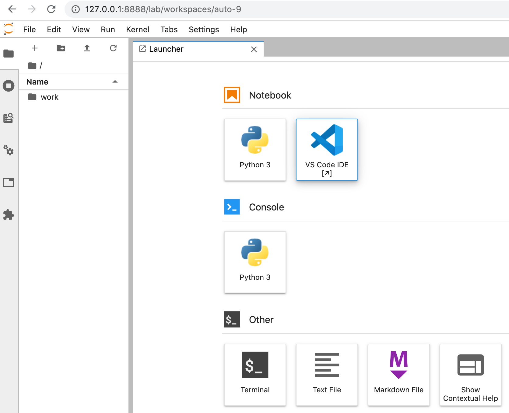

Jupyter code-server proxy
=========================

http://coder.com is a port of Microsoft Visual Studio Code to the browser.

This package is a plugin for [jupyter-server-proxy](https://jupyter-server-proxy.readthedocs.io/)
that lets you run an instance of [code-server](https://github.com/cdr/code-server) alongside your Jupyter notebook, primarily
in a JupyterHub / Binder environment.

A `Dockerfile` illustrates the way to integrate it in one of the [Jupyter Docker Stacks](https://github.com/jupyter/docker-stacks).

How to
------

A `Makefile` gather the main commands.

```bash
$ make

# code-server proxy
# =================
# 
# build-image                    build the latest image
# build-package                  build the python package
# build                          build the package and the image
# clean                          remove python package target dirs
# dev                            run a foreground container
# run-sudo                       run a bash in interactive mode as root in the stack
# run                            run a bash in interactive mode in the stack
# upload                         upload the package
```

For example to build the package, integrate it in the image and launch it.

```bash
$ make build
# ...
# Successfully tagged codeserver-notebook:latest
# Built image size: 2.08GB
$ make dev

# ...
# [I 07:14:39.235 LabApp] Jupyter Notebook 6.1.4 is running at:
# [I 07:14:39.236 LabApp] http://d30367ff292a:8888/?token=048a06d6769cc34698365cfa427904d80b43498faaefb4e2
# [I 07:14:39.237 LabApp]  or http://127.0.0.1:8888/?token=048a06d6769cc34698365cfa427904d80b43498faaefb4e2
# [I 07:14:39.238 LabApp] Use Control-C to stop this server and shut down all kernels (twice to skip confirmation).
```

And that's it!



*Note: The code-server working directory (`CODE_WORKINGDIR` environment variable) is set to `"${HOME}/work"` which is the default home directory for Jupyter.*